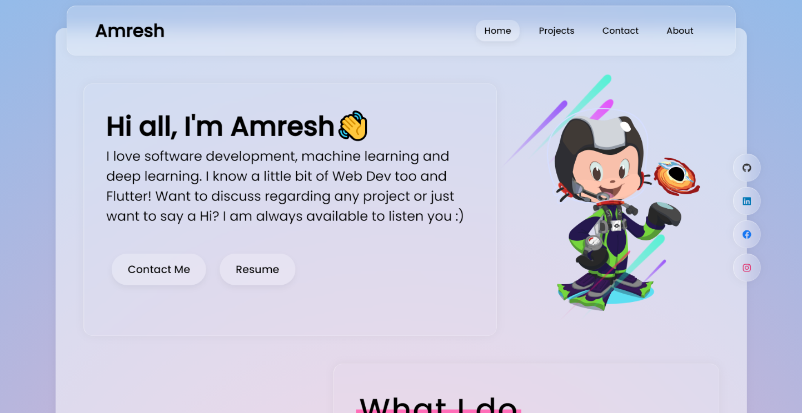
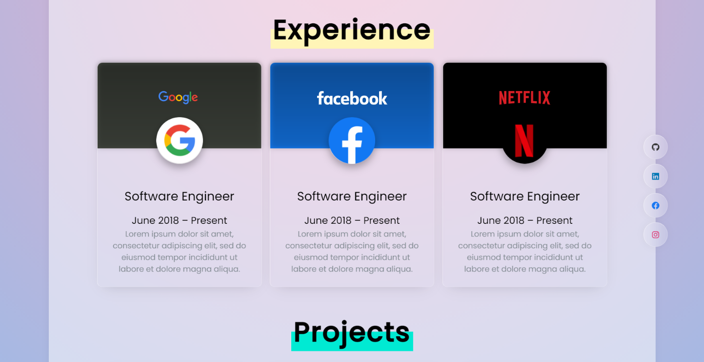
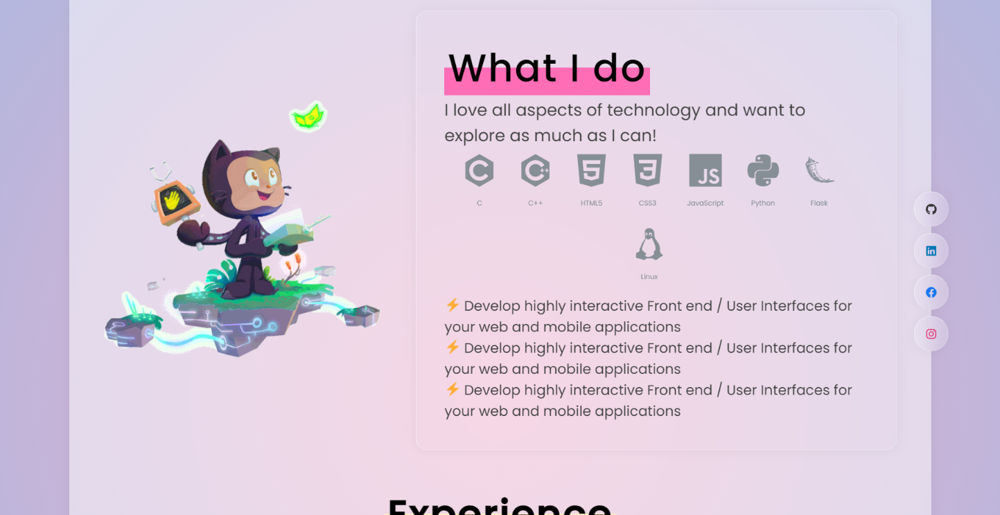
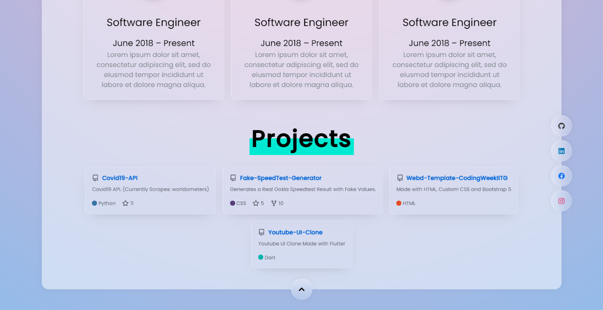

<h1 align="center"> Vighnesh ✨ | Dev Portfolio
<br>


</h1>


<h2 align="center">
Made with Pure HTML, CSS and JS<br>
Inspired by <a href="https://github.com/saadpasta/developerFolio/">developerFolio</a>
</h2>

<div style="display:flex; gap:5px;">
    <div style="display: inline-block;">
        
    </div>
</div>
<div style="display:flex; gap:5px;">
    <div style="display: inline-block;">
        
    </div>
</div>

<p align="center"><strike>Currently Not Mobile Responsive!</strike> Now it is :)</p>

<p align="center">Change the content in <code>index.html</code> and you are good to go :)</p>

<p align="center">If you want to contribute head over to <a href="#">Issues</a> first ;)</p>
<p align="center">Feel free to open a <a href="#">Pull Request</a> if you added something new to it!</p>

## Sections
✔️ Summary and About me\
✔️ Skills\
✔️ Work Experience\
✔️ Open Source Projects Connected with Github\
😃 Feel Free to contribute ;)

Live Version: https://AmreshSinha.github.io/glassFolio/

## Linking your github repo
This project utilises the modified version of <a href="https://github.com/Tarptaeya/repo-card">Repo-Card</a> which utilises Github Free API to fetch details.

Keep in mind that the Free API is Rate Limited.

Format:

```
<div class="repo-card" data-repo="username/repository"></div>
```

Just change ```username``` and ```repository``` to yours and you are good to go!

## Features
- GlassMorphic UI
- Supports FontAwesome
- Supports <a href="https://github.com/devicons/devicon">DevIcon</a>
- Supports Iconify

## Author

👤 **Vighnesh**


## 🤝 Contributing

Your awesome contribution will make this project better, issues and feature requests are welcome!<br />Feel free to check [issues page](#).


## 📝 License

This project is under [MIT License](https://github.com/AmreshSinha/glassFolio/blob/main/LICENSE).

## Special mentions
- <a href="https://github.com/saadpasta/developerFolio/">hsaadpasta/developerFolio</a>
- <a href="https://github.com/Tarptaeya/repo-card">Tarptaeya/repo-card</a>


## Project Contributors⭐ 

<table align="center">
<tr>
<td>
<a href="#" align="center">
   
</a>
</td>
</tr>
</table>
